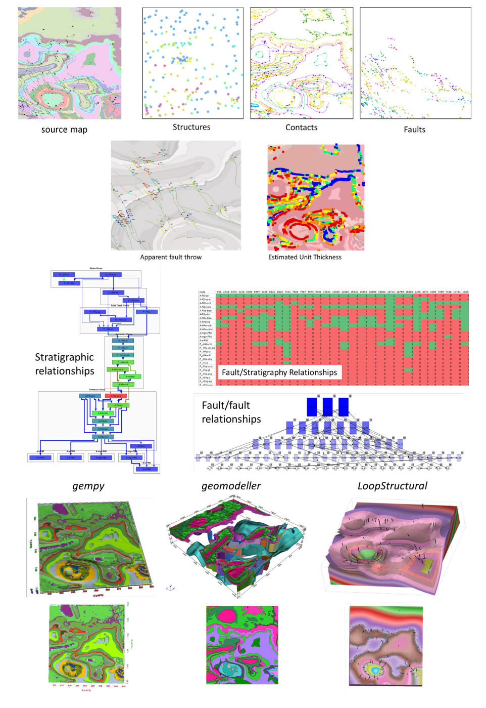

# map2loop Package

A package to extract information from geological maps to feed 3D modelling packages

### This is very much a proof of concept code that is unlikely to work first time with anything but the example dataset provided, but if you would like to try it with your own data please feel free to contact me at mark.jessell@uwa.edu.au to discuss your plans.  

### Fastest install path (thanks to Yohan de Rose) is via docker, go to development version at:
       
   http://github.com/Loop3D/map2loop-2    
   
Try the *1. All in one - All engines - new_interpolation_test.ipynb* notebook.
   
A recent workshop as part of the Loop/MinEx CRC collaborations provides a tutorial for map2loop and dh2loop codes. It refers to a Virtual Machine but all the codes and data can installed as above. The tutorial notes are available here: <a href="https://github.com/Loop3D/map2loop/tree/master/docs/map2loop_dh2loop_tutorial.pdf" target="_blank"> HERE</a> but are now out of sync with the latest notebooks      
   
#### What it does:
  
-  Combines information extracted from vector geology maps in various forms to supoprt 3D geological modelling. Outputs are simple csv files that should be readable by any 3D modelling system (I think).

#### Inputs: (example data supplied) 
   
- Geology as Polygons  
- Fault and fold axial trace as PolyLines  
- Structure measurements (bed dips)
- Graphs are created in-code from Vitaliy's map2model cpp code as Points
- See below for more details
  
#### map2loop outputs:
   

#### map2loop outputs:

| content | filename | created by | example notebook |
| ----- | ----- | ----- | ----- |
| Various stratigraphic topology graphs  | \*/graph/\*.gml | map2model cpp code in Notebook 1 |  1 |
| Group-level stratigraphic relationships | \*/tmp/groups.csv | m2l_topology. save_group |  1 |
| Formation-level stratigraphic relationships | \*/tmp/\*_groups.csv | m2l_topology. save_units |  1 |
| Summary strat relationships | \*/tmp/all_sorts.csv or all_sorts_clean.csv| m2l_topology. save_units |  1 |
| Fault-fault relationship table | \*/output/fault-fault-relationships.csv | m2l_topology. parse_fault_relationships |  1 |
| Fault-fault relationship graph | \*/output/fault_network.gml | m2l_topology. parse_fault_relationships |  1 |
| Fault-unit relationship table | \*/output/unit-fault-relationships.csv | m2l_topology. parse_fault_relationships |  1 |
| Fault-group relationship table | \*/output/group-fault-relationships.csv | m2l_topology. parse_fault_relationships |  1 |

##### Digital Terrain Model:

| content | filename | created by | example notebook |
| ----- | ----- | ----- | ----- |
| dtm in lat long wgs83 | \*/dtm/dtm.tif | m2l_utils.get_dtm |   1 |
| georeferenced dtm | \*/dtm/dtm_rp.tif| m2l_utils.reproject_dtm |  1 |

##### Geometry:

| content | filename | created by | example notebook |
| ----- | ----- | ----- | ----- |
| Contact info with z and formation | \*/output/contacts4.csv or contacts_clean.csv| m2l_geometry. save_basal_contacts |  1 |
| Fault trace with z | \*/output/faults.csv | m2l_geometry. save_faults |  1 |
| Basal contacts shapefile | \*/tmp/basal_contacts.shp | m2l_geometry. save_basal_no_faults |  1 |
| Clipped geology map shapefile | \*/tmp/geol_clip.shp | Notebook 1 |  1 |
| Clipped fault & fold axial traces shapefile  | \*/tmp/faults_clip.shp | Notebook 1 |  1 |
| Pluton contacts with z and formation | \*/output/ign_contacts.csv | m2l_geometry. process_plutons |  1 |
| Local formation thickness estimates | \*/output/formation_thicknesses_norm.csv and formation_summary_thickness.csv| m2l_geometry. calc_thickness and normalise_thickness|  2 |
| Fault dimensions | \*/output/fault_dimensions.csv | m2l_geometry. save_faults |  1 |
| Fault displacements | \*/output/fault_displacement3.csv | m2l_interppolation. process_fault_throw_and_near_faults_from_grid |  1 |
| Fault strat & thickness-based displacements | \*/output/fault_strat_offset3.csv | m2l_geometry. fault_strat_offset  |  1 |
| Near-Fault strat contacts | \*/output/fault_tip_contacts\*.csv | m2l_interppolation. process_fault_throw_and_near_faults_from_grid |  1 |
##### Orientations:

| content | filename | created by | example notebook |
| ----- | ----- | ----- | ----- |
| Bed dip dd data with z and formation | \*/output/orientations.csv or orientations_clean.csv| m2l_geometry. save_orientations |  1 |
| Bed dip dd data with calculated polarity | \*/output/orientations_polarity.csv | m2l_geometry. save_orientations_with_polarity |  1c |
| Extra orientations for empty series | \*/output/empty_series_orientations.csv | m2l_geometry. create_orientations |  1 |
| Fault orientation with z | \*/output/fault_orientations.csv |  m2l_geometry. save_faults |  1 |
| Clipped orientations shapefile | \*/tmp/structure_clip.shp | Notebook 1 |  1 |
| Interpolated dip dip direction grid | \*/tmp/interpolated_orientations.csv | m2l_interpolation. interpolate_orientations_grid |  1 |
| Interpolated contact vector grid | \*/tmp/interpolated_contacts.csv | m2l_interpolation. interpolate_contacts_grid |  1 |
| Combined interpolation grid | \*/tmp/interpolated_combined.csv | m2l_interpolation. interpolation_grids |  1 |
| Pluton contact orientations | \*/output/ign_orientations_\*.csv | m2l_geometry. process_plutons |  1 |
| Near-Fold Axial Trace strat orientations | \*/output/fold_axial_trace_orientations2\.csv | m2l_geometry. save_fold_axial_traces_orientations |  5 |
| Estimated contact orientations | \*/output/contact_orientations\.csv | m2l_geometry. save_basal_contacts_orientations_csv |  1 |

##### loop2model:
| content | filename | created by | example notebook |
| ----- | ----- | ----- | ----- |
| Gempy | Notebook creates 3D model itself | m2l_export. loop2gempy |  1a |
| Basic vtk model thanks to gempy  | \*/vtk/\*.vtp | gempy |  1 |
| Geomodeller | m2l.taskfile | m2l_export. loop2geomodeller |  1b  |
| LoopStructural | Notebook creates 3D model itself | m2l_export. loop2LoopStructural |  1c  |

Does not deal with sills yet.  
  
Standalone map2model cpp code from Vitaliy provides fault/fault and fault/strat relationships   

#### Installation
The best path to isntallation is via a docker. To do this visit the development version at https://github.com/Loop3D/map2loop-2 and follow the instructions.
  
#### Requirements
rasterio
matplotlib
networkx
numpy
pandas
geopandas
os
urllib
sys
math
shapely
gempy
   
#### Simplified calculation schemes   
##### 1)	Topology   
###### a.	Stratigraphic relationships   
i.	Adjacency relationships between neighbouring geological polygons based on formation and group   
ii.	Directed graph based on these relationships and relative age of formations and groups   
iii.	Edges attributed by type of contact (intrusive, stratigraphic, fault)   
   
###### b.	Fault relationships   
i.	Relative ages of faults longer than a specified length estimated from truncation relationships   
ii.	Directed graph based on these relationships   
iii.	Cyclic relationships removed (A truncates B; B truncates C; C truncates A)   
   
###### c.	Fault-stratigraphy relationships   
i.	Adjacency matrices of relative ages of faults longer than a specified length and formations and groups based on truncation relationships   
   
##### 2)	Position Data   
###### a.	DTM   
i.	DTM downloaded for defined bounding box from SRTM server   
ii.	Re-projected to local EPSG-defined projection system   
   
###### b.	Basal contacts   
i.	Formation based on stratigraphic relationship (assigned to younger formation)   
ii.	X,Y from contact nodes with optional decimation   
iii.	Z from DTM   
iv.	Nodes that are defined by faults are removed   
   
###### c.	Igneous contacts   
i.	Formation based on intrusive unit   
ii.	X,Y from contact nodes with optional decimation   
iii.	Z from DTM   
iv.	Nodes that are defined by faults are removed   
   
###### d.	Faults   
i.	Fault name based on id of fault   
ii.	Optional removal of faults below a certain fault-tip to fault-tip distance   
iii.	X,Y from fault nodes with optional decimation   
iv.	Z from DTM   
   
###### e.	Fold axial traces   
i.	Fold axial trace name based on id of fold axial trace   
ii.	X,Y from fold axial trace nodes with optional decimation   
iii.	Z from DTM   
   
###### f.	Local formation thickness   
i.	X,Y from basal contact nodes   
ii.	Z from DTM   
iii.	Thickness from distance from normal to local contact orientation to stratigraphically next upper contact polyline in the taking into account the local orientation of bedding estimated from the interpolation of basal contacts and primary orientation data   
iv.	Normalised formation thickness calculated for each node based on division by median of thicknesses for each formation   
   
###### g.	Local fault displacement   
i.	X,Y from fault contact nodes   
ii.	Z from DTM   
iii.	Displacement calculated by finding distance between equivalent stratigraphic contacts either side of the fault   
   
##### 3)	Gradient data   
   
###### a.	Primary dip/dip direction    
i.	Orientations of bedding, but filter out dip = 0   
ii.	X,Y from primary data with optional decimation   
iii.	Add Z from DTM   
iv.	Add geology polygon formation info   
   
###### b.	Fault orientations   

i.	Normal to fault tips for azimuth   
ii.	X,Y from midpoint between fault tips   
iii.	Dip as user-defined conceptual constraint   
   
###### c.	Near-Fold Axial Trace orientations   
i.	X,Y step out normal to fat from local nodes of fold axial trace polyline with optional decimation   
ii.	Add Z from DTM   
iii.	Dip direction from local normal to fat and sign of fold axis   
iv.	Dip arbitrarily set by user   

###### d. Near-fault orientations   
i.	X,Y step out normal to fault from local nodes of fault polyline with optional decimation   
ii.	Add Z from DTM   
iii.	Dip and dip direction from interpolation of basal contacts and primary orientation data   
iv.	Add geology polygon formation info   

###### e.	Empty series orientations   
   
###### f.	Igneous contacts   
i.	X,Y from local nodes of igneous contact polyline with optional decimation   
ii.	Add Z from DTM   
iii.	Dip and polarity arbitrarily defined by user   
iv.	Dip direction from local normal to igneous contact interpolation of basal contacts   
v.	Add geology polygon formation info   

#### Inputs  
Minimum map2loop inputs:  
  
1.	EPSG coordinate reference system for input data (metre-based projection like UTM)   
   
2.	Max/min coordinates of area of interest   
   
3.	Geology polygons:   
-a.	All polygons are watertight   
-b.	Polygons stop on faults   
-c.	Polygons have as attributes:   
-i.	Object ID   
-ii.	Stratigraphic code   
-iii.	Stratigraphic group   
-iv.	One of more fields that describe if sill, if igneous, if volcanic   
-v.	Min_age field   
-vi.	Max_age field (can be same as Min_age field, and can be simple numerical ordering (bigger number is older))   
   
4.	Fault/Fold Axial Trace Polylines:   
-a.	Faults terminate on other faults but do not cross   
-b.	Faults/Folds have as attributes:   
-i.	Object ID   
-ii.	Field that determines if polyline is fault or fold axial trace   
-iii.	Field that determine type of fold axial trace e.g. syncline or anticline)   
   
5.	Bedding orientations:   
-a.	Assumes dip/dip direction data   
-b.	Orientations have as attributes:   
-i.	Dip   
-ii.	Dip Direction   
   
